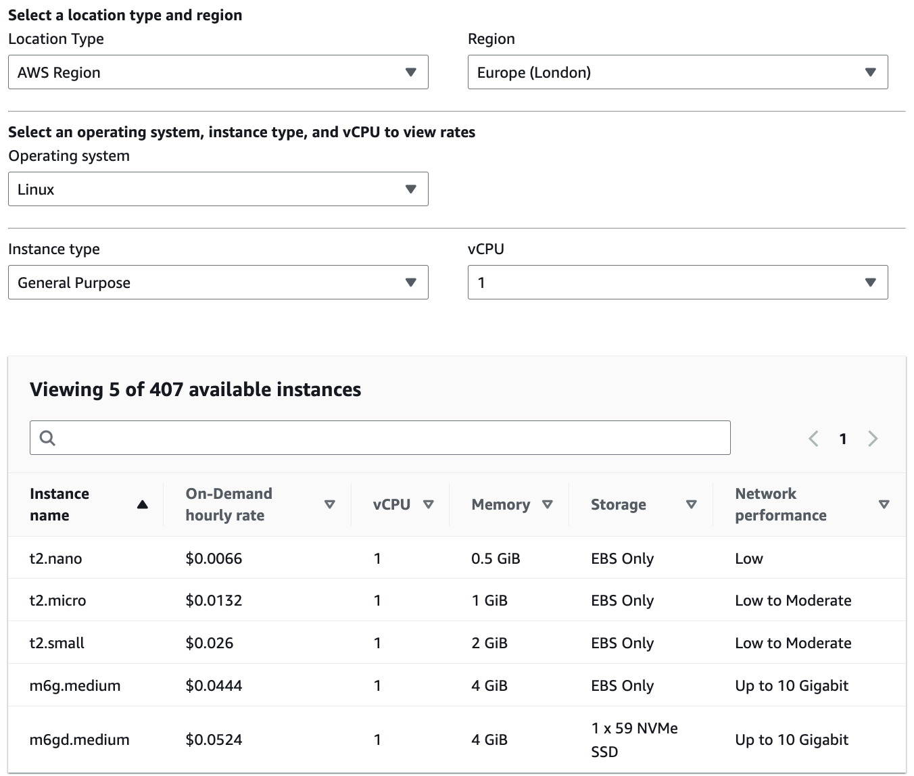

# jump4joy

<p align="center">
    <a href="https://github.com/M-Davies/jump4joy">
        
    </a>
    <br/>
    <a href="https://saythanks.io/to/M-Davies">
        
    </a>
    <a href="https://github.com/M-Davies/jump4joy/blob/master/LICENSE">
        
    </a>
</p>

A simple AWS jumpbox for personal and business use.

## Table of Contents

- [Description](#Description)
- [Requirements](#Requirements)
    - [Installation](#Installation)
- [Usage](#Usage)

## Description

This is a Python script that deploys an [AWS CloudFormation Stack](https://docs.aws.amazon.com/AWSCloudFormation/latest/UserGuide/stacks.html) containing an EC2 instance you can use as your own cloud-hosted VPN, SOCKS proxy and HTTP proxy server. The currently supported services are:

- [OpenVPN provided by the openvpn-install script](https://github.com/angristan/openvpn-install)
- [HTTP Proxy provided by TinyProxy](https://tinyproxy.github.io/)
- [SOCKS5/4 Proxy provided by Dante](https://www.inet.no/dante/)

Planned services include:

- [Wireguard provided by the wireguard-install script](https://github.com/angristan/wireguard-install). See [#2](https://github.com/M-Davies/jump4joy/issues/2) for progress on this.

The reasons you may want to self host your own service like this are multifold but the main ones I've found are:

- It's cheaper than paying for a enterprise or subscription service VPN or proxy. For example, according to the November 2023 cost estimates for AWS [here](https://aws.amazon.com/ec2/pricing/on-demand/), the cost of running a `t2.micro` instance in London (which is what this stack uses by default) constantly up for a month is only ~$9.64 ($0.0132 per hour * 730 hours in a month):

- It's more modular. This script allows you to pass your own AWS templates, installation script files and authentication credentials for the various services that will be deployed
- It's easy and quicker to setup and teardown. Better to have a script that deploys everything you need in one go than creating a new instance and configuring it how you like it each time
- Variable and anonymous IP addresses. IP addresses belonging to VPNs [are known and blocked](https://cybernews.com/how-to-use-vpn/bypass-vpn-blocks/#types-of-vpn-blocks) by some sites that do not want their users utilising a VPN (*cough* netflix *cough*). Having your own VPN allows you to bypass these problems.

Basically, it's just very useful, hence why this project is a thing! All feedback, feature requests and bug/security reports are welcome. Open an issue at https://github.com/M-Davies/jump4joy/issues/new/choose if you have one of the above.

## Requirements

- An AWS Root or IAM Account (IAM is recommended) with the following permissions:
    - Create, Read and Update permissions for `CloudFormation:Stacks` (for interacting with the stacks)
    - Create, Read and Update permissions for `SSM:ParameterStore` (Systems Manager) entries created by the CloudFormation stack. This is so it can grab the private key for SSH access to install software
    - Create, Read and Update permissions for `EC2:KeyPairs`
    - Create, Read and Update permissions for `EC2:SecurityGroups`
    - Create, Read and Update permissions for `EC2:Instances`
    - ***WARNING:** I am no expert with AWS permissions so I have created my test users with full access to the 3 cloud services mentioned above (`AmazonEC2FullAccess`, `AmazonSSMFullAccess` & `AWSCloudFormationFullAccess`). This is by no means best practice, you should assign your user with the minimum permissions possible.*
- AWS Access Key for the account above (having a [~/.aws/credentials](https://docs.aws.amazon.com/cli/latest/userguide/cli-chap-configure.html) file with working creds is also fine)
- Python 3
    - Version 3.11.4 is recommended but the script should work with most modern versions of Python 3

### Installation

This is one typical method of installation for general use, authentication to AWS especially may differ in hardened environments. For more options, see [#Usage](#Usage) below.

1. Setup your AWS IAM account and sign into it with a new AWS CLI profile
2. Install python dependencies: `python -m pip install -r requirements.txt`
3. Run the script with your custom usage options. For example: `python jump4joy.py -v -s http openvpn socks -p aws_profile_jump4joy`
4. Enjoy your new jumpbox!

## Usage

```
$ python jump4joy.py -h
usage: jump4joy [-h] [-p PROFILE] [-r REGION] [-i ACCESS_KEY_ID] [-k SECRET_ACCESS_KEY] [-s SERVICES [SERVICES ...]]
                [-t TEMPLATE_FILE] [-f INSTALL_SCRIPT] [-d] [--timeout TIMEOUT] [--whitelisted-ip-range WHITELISTED_IP_RANGE]
                [--http-user HTTP_USER] [--socks-user SOCKS_USER] [--openvpn-user OPENVPN_USER]
                [--openvpn-config OPENVPN_CONFIG] [-v] [-c CREDENTIALS_FILE] [-q] [-l LOG]

A simple AWS jumpbox for personal and business use.

options:
  -h, --help            show this help message and exit
  -p PROFILE, --profile PROFILE
                        The profile to use in your AWS credentials file. The --region, --access-key-id and --secret-access-key
                        will override the profile options you provide here. Defaults to the 'default' profile
  -r REGION, --region REGION
                        The region to create your jumpbox in. The credentials you provide should have access to the region you
                        specify here
  -i ACCESS_KEY_ID, --access-key-id ACCESS_KEY_ID
                        AWS Access Key ID
  -k SECRET_ACCESS_KEY, --secret-access-key SECRET_ACCESS_KEY
                        AWS Secret key of the key you provided for (--access-key-id)
  -s SERVICES [SERVICES ...], --services SERVICES [SERVICES ...]
                        The forwarding proxy or VPN services to install on the box. By default, this includes all supported
                        services. Supply a different set of services here if you so choose, seperated by spaces (e.g. '--
                        services http socks openvpn')
  -t TEMPLATE_FILE, --template-file TEMPLATE_FILE
                        Custom CloudFormation template file path. Defaults to the provided template
                        (/Users/morgan/Documents/Repos/jump4joy/cloud-formation-template.yml). The parameters and names must
                        follow a similar format to the ones provided in the example file (cloud-formation-template.yml)
  -f INSTALL_SCRIPT, --install-script INSTALL_SCRIPT
                        Custom install script to run on the EC2 box. Defaults to the provided template
                        (/Users/morgan/Documents/Repos/jump4joy/install-software.sh). The parameters and names must follow a
                        similar format to the ones provided in the example file (install-software.sh)
  -d, --disable-colours
                        Disables colouring of log output. You might find this option useful if you're exclusively writing to a
                        log file or running this on Windows.
  --timeout TIMEOUT     Timeout for the software install script in seconds. Defaults to 1800 (30 minutes)
  --whitelisted-ip-range WHITELISTED_IP_RANGE
                        Whitelisted Cidr IP address range that can access the jumpbox services. Must be in Cidr format (e.g.
                        '183.231.111.41/32' or '0.0.0.0/0' for publicly accessible). Defaults to your public IP and then to
                        publically accessible (if the script cannot work out your public IP).
  --http-user HTTP_USER
                        Username of the HTTP proxy user (password will be generated automatically). Defaults to 'httpuser123'
  --socks-user SOCKS_USER
                        Username of the SOCKS proxy user (password will be generated automatically). This will also be a non-
                        login user on the EC2 Ubuntu OS. Defaults to 'socksuser123'
  --openvpn-user OPENVPN_USER
                        Clientname of the OpenVPN client. Defaults to 'openvpnclient123'
  --openvpn-config OPENVPN_CONFIG
                        Path to where the OpenVPN config file (containing the connection and authentication information) will be
                        output to. Defaults to the current directory
  -v, --verbose         Increase verbosity, will report progress for each interaction rather than just warnings and errors
  -c CREDENTIALS_FILE, --credentials-file CREDENTIALS_FILE
                        Saves the credentails for the proxy and VPN services to a JSON file you specify instead of STDOUT
  -q, --quiet           No output to the console (output will be logged to a file), only exceptions will be shown. NOTE: If this
                        option is specified, --credentials-file must also be specified
  -l LOG, --log LOG     Produces a log file of verbose and non-verbose debug information at the path provided.

Authored by @M-Davies. Please submit feedback and bug reports to https://github.com/M-Davies/jump4joy
```


